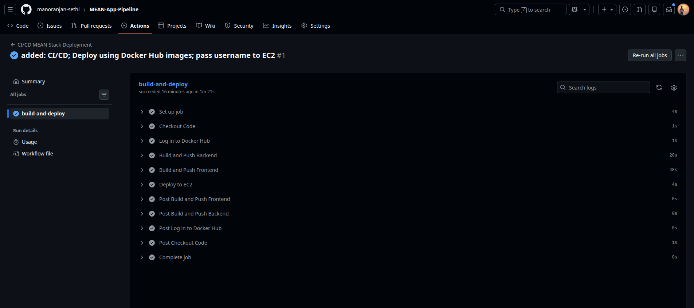

# MEAN Stack Automated Deployment Pipeline 🚀

This repository contains the complete containerization, infrastructure configuration, and CI/CD pipeline for a full-stack MEAN (MongoDB, Express, Angular, Node.js) application. 

The deployment is fully automated using GitHub Actions, containerized via Docker, and hosted on an AWS EC2 Ubuntu instance with Nginx acting as a reverse proxy.

## 📋 Task Deliverables Checklist
-  **Repository Setup:** Code pushed to GitHub.
-  **Containerization:** Dockerfiles created for both frontend and backend. Docker Compose used for orchestration.
-  **Database Setup:** Utilized the official MongoDB Docker image.
-  **CI/CD Pipeline:** GitHub Actions workflow configured to build, push to Docker Hub (tagged with commit hash), and deploy automatically to EC2 on push.
-  **Nginx Reverse Proxy:** Nginx configured to route all traffic seamlessly over Port 80.

---

## 🏗️ Architecture Overview
* **Frontend:** Angular application served by an internal Nginx container on Port 80.
* **Reverse Proxy:** The frontend Nginx server also acts as a reverse proxy, intercepting `/api/` calls and routing them to the backend container over the private Docker network.
* **Backend:** Node.js/Express API running on Port 8080 (internal network only).
* **Database:** Official MongoDB container running on Port 27017 (internal network only).

---

## 🔒 DevSecOps & Security Highlights
* **Principle of Least Privilege (Network):** AWS Security Group is strictly limited to Ports 80 (HTTP), 443 (HTTPS), and 22 (SSH). Container ports (8080, 8082, 27017) are deliberately closed to the public internet to prevent direct access/bypassing of the Nginx proxy.
* **Immutable Artifacts:** The CI/CD pipeline tags images with the Git commit hash (short SHA) and uses `docker pull` for deployment rather than rebuilding on the host, ensuring the exact artifact tested in CI is what runs in production.
* **Secret Management:** All sensitive credentials (Docker Hub tokens, SSH keys, Host IPs) are encrypted and injected via GitHub Actions Secrets.

---

## ⚙️ Step-by-Step Setup and Deployment Instructions

### 1. Infrastructure Provisioning
1. Launch an Ubuntu EC2 instance on AWS.
2. Configure the Security Group inbound rules:
   * **SSH:** Port 22 (from admin IP only)
   * **HTTP:** Port 80 (from 0.0.0.0/0)
   * **HTTPS:** Port 443 (from 0.0.0.0/0)
3. SSH into the instance and install Docker and Docker Compose.

### 2. GitHub Actions Configuration
To deploy this project to your own environment, configure the following **Repository Secrets** in GitHub:
* `DOCKER_USERNAME`: Your Docker Hub username.
* `DOCKER_PASSWORD`: Your Docker Hub Personal Access Token (PAT).
* `SSH_HOST`: The public IP of your EC2 instance.
* `SSH_USER`: The SSH username (e.g., `ubuntu`).
* `SSH_PRIVATE_KEY`: The `.pem` private key for SSH access.

### 3. Triggering the Deployment
Once secrets are configured, any code pushed to the `main` branch (excluding changes to `.md` files only) will automatically trigger the `.github/workflows/deploy.yml` pipeline.
1. The pipeline authenticates with Docker Hub.
2. Builds the `mean-frontend` and `mean-backend` images.
3. Pushes the artifacts to Docker Hub tagged with the short commit hash (e.g. `a1b2c3d`).
4. Connects to the EC2 instance via SSH.
5. Pulls the commit-tagged images and restarts the Docker Compose stack using `sudo -E docker compose up -d`.

---

## 📸 Deployment Screenshots

### 1. CI/CD Configuration and Execution
*Successful execution of the GitHub Actions workflow showing Build, Push, and Deploy steps.*
> []

### 2. Docker Image Build and Push Process
*Artifacts successfully pushed to the Docker Hub registry.*
> [.png)]

### 3. Application Deployment and Working UI
*The application running live on the EC2 instance, accessible purely via Port 80 without port definitions.*
**Live URL:** `http://44.202.62.151/`
> [.png)]

### 4. Nginx Setup and Infrastructure Details
*Nginx reverse proxy routing configured within the frontend container, alongside the locked-down AWS Security Group.*

> [.png)]

> [.png)]
